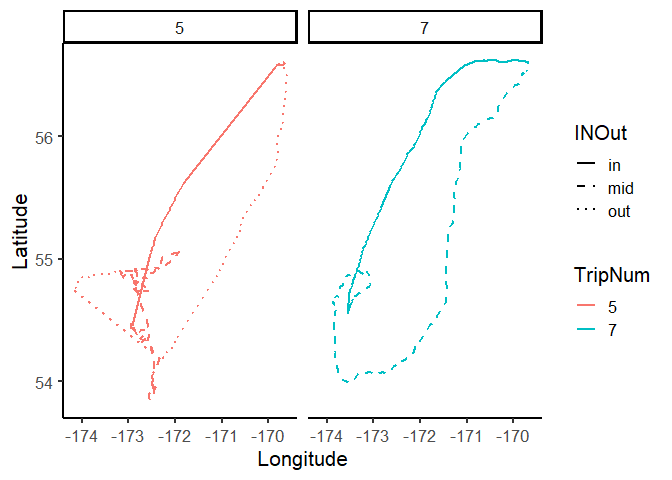
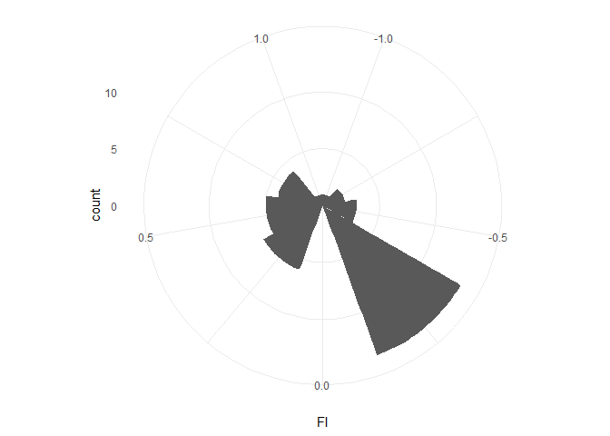

Basic Trip Segmentation
================

## Trip segmentation for animal tracking data

[](https://doi.org/10.5281/zenodo.2888340)


Cite as: Fleishman, A.B. and Orben, R.A. 2019. trakR: Basic Animal
Tracking Data Analysis Tools. GitHub repository.
<https://github.com/abfleishman/trakR> <DOI:10.5281/zenodo.2888340>

``` r
library(ggplot2)
library(maps)
library(mapdata)
library(dplyr)
```

    ## Warning: package 'dplyr' was built under R version 3.5.2

``` r
library(stringr)
library(lubridate)
library(argosfilter)
```

# Install trakR package

``` r
# install.packages("devtools") # for installing packages from github
# devtools::install_github("abfleishman/trakR",upgrade = "ask") # install my package

library(trakR)
```

# Load tracks

This should be one file for all the tracks or create a data.frame with
all the tracks. The function `MakeTrip` is set up for processing
multiple animals at once, but you can use it one a single track as well,
it is just not as elegant.

For this tutorial we will use a single bird in the included `tracks`
dataset.

``` r
data("tracks")

head(tracks)
```

    ##              DateTime Longitude Latitude CaptureID Dist2Colony
    ## 1 2015-06-24 03:34:21 -169.6760 56.60329       B53 0.052719955
    ## 2 2015-06-24 03:36:03 -169.6765 56.60260       B53 0.094288021
    ## 3 2015-06-24 13:39:08 -169.6768 56.60336       B53 0.008751334
    ## 4 2015-06-24 13:42:05 -169.6768 56.60339       B53 0.006336524
    ## 5 2015-06-24 13:45:08 -169.6768 56.60345       B53 0.007025605
    ## 6 2015-06-24 13:48:08 -169.6768 56.60343       B53 0.003676799

The `MakeTrip` function requires a column with distances to the colony
for each point. The `Dist2Colony` function will calculate these
distances. It requires the `argosfilter` package to run.

``` r
library(argosfilter)
tracks$Dist2Col<-trakR::Dist2Colony(tracks = tracks, 
                                    dataLat = "Latitude",
                                    dataLon = "Longitude",
                                    ColonyLat = 56.60329,
                                    ColonyLong = -169.6760)
```

# Split Trips

The `MakeTrip` function finds the points where a animal moves some
threshold distance `DistCutOff` away from the colony and the points
where the animal returns within that threshold that is at least some
number of points long `NumLocCut`. The function annotates the dataframe
with two new column, one indicating those “In” and “Out” points and
another with trip numbers.

``` r
tracks_w_trips<-trakR::MakeTrip(tracks = tracks,
                                ID = "CaptureID",
                                DistCutOff = 0.1,
                                Dist2Colony = "Dist2Col",
                                NumLocCut = 3)
```

    ## [1] "CaptureID B53"

``` r
head(tracks_w_trips)
```

    ##              DateTime Longitude Latitude CaptureID Dist2Colony    Dist2Col
    ## 1 2015-06-24 03:34:21 -169.6760 56.60329       B53 0.052719955 0.002265022
    ## 2 2015-06-24 03:36:03 -169.6765 56.60260       B53 0.094288021 0.082873349
    ## 3 2015-06-24 13:39:08 -169.6768 56.60336       B53 0.008751334 0.049632033
    ## 4 2015-06-24 13:42:05 -169.6768 56.60339       B53 0.006336524 0.049436610
    ## 5 2015-06-24 13:45:08 -169.6768 56.60345       B53 0.007025605 0.049489926
    ## 6 2015-06-24 13:48:08 -169.6768 56.60343       B53 0.003676799 0.051277755
    ##   ColonyMovement TripNum
    ## 1           <NA>       0
    ## 2           <NA>       0
    ## 3           <NA>       0
    ## 4           <NA>       0
    ## 5           <NA>       0
    ## 6           <NA>       0

``` r
# Plot a bird to check
ggplot(tracks_w_trips,aes(Longitude,Latitude,col=factor(TripNum)))+
  geom_path(size=.7)+
  geom_point(data=tracks_w_trips[tracks_w_trips$ColonyMovement%in%c("Out","In"),])+
  theme_classic(base_size = 16)+labs(color="TripNum")
```

<!-- -->

## trip segmentation

Another common task in processing tracking data is to segment a trip
into a outbound, middle, and inbound legs. This can be done tediously by
annotating each trip by hand or you can try using the `InOutPoints`
function in `trakR`. This function also relies on having a columns with
the distance to the colony. There are also a few more esoteric
parameters that take some fiddling to get right.  
From the function documentation that can be accessed by `?InOutPoints`:

This function’s intention is to partition a track into an inbound and
outbound leg demarcated when the bird first stops moving away from the
colony. The first stopping point is identified by taking the change in
dist2col first derivative, smoothing it with a left aligned rolling
mean, and rounding to 1 digit. The first point where the bird is not
changing the distance to the colony is the end of the outbound leg,
while the last point where the birds is not getting close to the colony
is the inbound leg.

Trip departure and return segments are identified by calculating delta-d
, the change in distance from the colony, lagged by `lag` gps points,
and smoothed by calculating a `nPointsToSmooth` left aligned rolling
mean. These values are rounded to 1 significant digit. Trips are
segmented by assigning points between the beginning of a trip and the
first point delta-d which equaled zero as the “out” leg and the last
point delta-d that equaled zero until the final point of the trip as the
“in” leg. The colony is buffered so that the first and last points
delta-d can not be within `minDist2Col` km of the island. If there is no
point on the trip that delta-d reached zero, i.e. the bird continuously
moved away from the colony until it began to return, the trip is split
at the apex point where the bird was furthest from the colony. This
method effectively finds the first and last points that the bird ceases
to move away from the colony over a given period the duration of which
is dictated by `nPointsToSmooth`\*interpoint duration.

``` r
tracks_w_trips$INOut<-InOutPoints(tracks=tracks_w_trips,
                          CaptureID="CaptureID",
                          DateTime="DateTime",
                          TripID="TripNum",
                          dist2colony="Dist2Colony",lag=3,
                          nPointsToSmooth =10,minDist2Col = 10,
                          Lon = "Longitude",Lat="Latitude",
                          Plot = T,pdfName = "inout_plots.pdf")

ggplot(tracks_w_trips[tracks_w_trips$TripNum%in%c(5,7),],
       aes(Longitude,Latitude,col=factor(TripNum)))+
  geom_path(aes(lty=INOut),size=1)+
  scale_linetype_manual(values = c(1,2,3))+
  facet_wrap(~TripNum)+
  theme_classic(base_size = 16)+labs(color="TripNum")
```

<!-- -->

## Trip (foraging location) fidelity

Sometimes you might be interested in understanding whther or not an
animal returns to the same areas over multiple trips. Below we will
calculate a simple metrics per birds of fidelity.

This function compares maximum displacement (distance and angle) of two
separate trips from a point of origin. Multiple displacement values can
be compared. These displacement values are centered and scaled to create
an index of site fidelity that ranges -1 to 1. A positive value mean
trips are similar and a negative value means the are different.

Used for calculation of Fidelity Index as described by: Gilmour, ME, JA
Castillo-Guerrero, AB Fleishman, S Hernandez-Vazquez, HS Young, SA
Shaffer. 2018. Plasticity of foraging behaviors in response to diverse
environmental conditions. Ecosphere 9(7):e02301.
<https://doi.org/10.1002/ecs2.2301> (open access)

The equations used here are modified from: - Willis-Norton et al. 2015.
Deep-Sea Research Part II: Topical Studies in Oceanography 113:260-267 -
Hazen et al. 2016. Journal of Applied Ecology 54:1415-1428, and -
Shaffer et al. 2017. Movement Ecology 5:27
<https://doi.org/10.1186/s40462-017-0118-9>.

``` r
# add a colony site name and join on inf0 about that site.  this is set up for
# having multiple capture sites in a single dataframe
tracks_w_trips$site<-"Village"
capture_sites<-data.frame(site="Village",colony_lon=-169.6760,colony_lat= 56.60329,stringsAsFactors = F)

# join on the capture sites and calculate the bearing from each point to the colony
library(geosphere)
```

    ## 
    ## Attaching package: 'geosphere'

    ## The following object is masked from 'package:argosfilter':
    ## 
    ##     bearing

``` r
tracks_w_trips<-tracks_w_trips %>%
  left_join(capture_sites,by="site") %>%
  mutate(bear2col=geosphere::bearing(p1 = cbind(colony_lon,colony_lat),
                                     p2 = cbind(Longitude,Latitude)))
```

#### create the fidelity index.

This returns a list with two dataframes. one with all the data used to
calculate the index and one row per combination of trips for each
animal. This dataframe also has the fidelity index (FI colomn) for each
pair of trips. The second data.frame i the list has a mean fidelity
index per birds with the total N trip combinations used to calculate the
mean.

``` r
fidelity<-trakR::gilmour_fidelity(dat = tracks_w_trips,Longitude = "Longitude",Latitude = "Latitude",animal_id = "CaptureID",trip_id = "TripNum",distance2colony = "Dist2Colony",bear2col = "bear2col")

# rose plot of fidelity index per trip combo (this is just a single bird)
ggplot(fidelity$fidelity_index_trips)+
  geom_histogram(aes(x=FI),binwidth = .25)+
  coord_polar() +
  theme_minimal()
```

<!-- -->

``` r
fidelity$fidelity_index_animal
```

    ## # A tibble: 1 x 3
    ##   animal_id      FI FI_samplesize
    ##   <fct>       <dbl>         <int>
    ## 1 B53       0.00192            36
