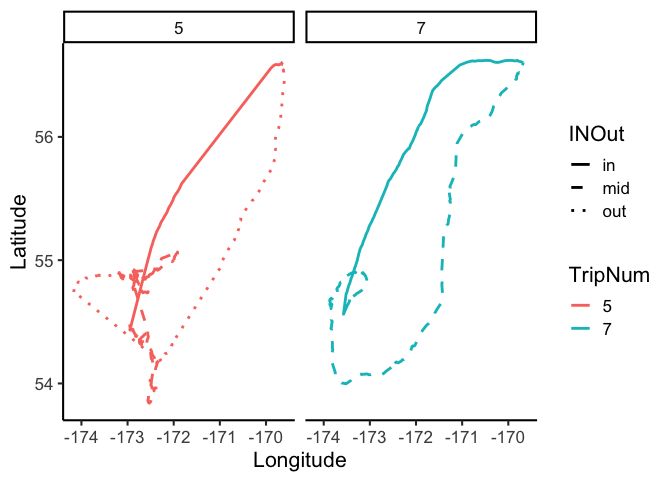

Basic Trip Segmentation
================

## Trip segmentation for animal tracking data

[](https://doi.org/10.5281/zenodo.2888340) []()

Cite as: Fleishman, A.B. and Orben, R.A. 2019. trakR: Basic Animal
Tracking Data Analysis Tools, V0.0.6. GitHub repository.
<https://github.com/abfleishman/trakR> <DOI:10.5281/zenodo.2888340>

``` r
library(ggplot2)
library(maps)
library(mapdata)
library(dplyr)
library(stringr)
library(lubridate)
library(argosfilter)
```

# Install trakR package (lots of issues but this trip segmentation works currently)

``` r
# install.packages("devtools") # for installing packages from github
# devtools::install_github("abfleishman/trakR",upgrade = "ask") # install my package

library(trakR)
```

# Load tracks

This should be one file for all the tracks or create a data.frame with
all the tracks. The function `MakeTrip` is set up for processing
multiple animals at once

For this tutorial we will use a single bird in the included `tracks`
dataset.

``` r
data("tracks")

head(tracks)
```

    ##              DateTime Longitude Latitude CaptureID Dist2Colony
    ## 1 2015-06-24 03:34:21 -169.6760 56.60329       B53 0.052719955
    ## 2 2015-06-24 03:36:03 -169.6765 56.60260       B53 0.094288021
    ## 3 2015-06-24 13:39:08 -169.6768 56.60336       B53 0.008751334
    ## 4 2015-06-24 13:42:05 -169.6768 56.60339       B53 0.006336524
    ## 5 2015-06-24 13:45:08 -169.6768 56.60345       B53 0.007025605
    ## 6 2015-06-24 13:48:08 -169.6768 56.60343       B53 0.003676799

The `MakeTrip` function requiers a column with distances to the colony
for each point. The `Dist2Colony` function will calculate these
distances. It requires the `argosfilter` package to run.

``` r
library(argosfilter)
tracks$Dist2Col<-trakR::Dist2Colony(tracks = tracks, 
                                    dataLat = "Latitude",
                                    dataLon = "Longitude",
                                    ColonyLat = 56.60329,
                                    ColonyLong = -169.6760)
```

# Split Trips

The `makeTrip` function finds the points where a animal moves some
treshold distance `DistCutOff` away from the colony and the points where
the animal returns within that threshold and annotates the dataframe
with two new column, one indicating those “In” and “Out” points and
another with trip numbers.

``` r
tracks_w_trips<-trakR::MakeTrip(tracks = tracks,
                                ID = "CaptureID",
                                DistCutOff = 0.1,
                                Dist2Colony = "Dist2Col",
                                NumLocCut = 3)
```

    ## [1] "CaptureID B53"

``` r
head(tracks_w_trips)
```

    ##              DateTime Longitude Latitude CaptureID Dist2Colony    Dist2Col
    ## 1 2015-06-24 03:34:21 -169.6760 56.60329       B53 0.052719955 0.002265022
    ## 2 2015-06-24 03:36:03 -169.6765 56.60260       B53 0.094288021 0.082873349
    ## 3 2015-06-24 13:39:08 -169.6768 56.60336       B53 0.008751334 0.049632033
    ## 4 2015-06-24 13:42:05 -169.6768 56.60339       B53 0.006336524 0.049436610
    ## 5 2015-06-24 13:45:08 -169.6768 56.60345       B53 0.007025605 0.049489926
    ## 6 2015-06-24 13:48:08 -169.6768 56.60343       B53 0.003676799 0.051277755
    ##   ColonyMovement TripNum
    ## 1           <NA>       0
    ## 2           <NA>       0
    ## 3           <NA>       0
    ## 4           <NA>       0
    ## 5           <NA>       0
    ## 6           <NA>       0

``` r
# Plot a bird to check
ggplot(tracks_w_trips,aes(Longitude,Latitude,col=factor(TripNum)))+
  geom_path(size=.7)+
  geom_point(data=tracks_w_trips[tracks_w_trips$ColonyMovement%in%c("Out","In"),])+
  theme_classic(base_size = 16)+labs(color="TripNum")
```

<!-- -->

## trip segmentation

Another common task in processing tracking data is to segment a trip
into a outbound, middle, and inbound leg. This can be done tediously by
anotating each trip by hand or you can try using the `InOutPoints`
function in `trakR`.

``` r
tracks_w_trips$INOut<-InOutPoints(tracks=tracks_w_trips,
                          CaptureID="CaptureID",
                          DateTime="DateTime",
                          TripID="TripNum",
                          dist2colony="Dist2Colony",lag=3,
                          nPointsToSmooth =10,minDist2Col = 10,
                          Lon = "Longitude",Lat="Latitude",
                          Plot = T,pdfName = "inout_plots.pdf")

ggplot(tracks_w_trips[tracks_w_trips$TripNum%in%c(5,7),],
       aes(Longitude,Latitude,col=factor(TripNum)))+
  geom_path(aes(lty=INOut),size=1)+
  scale_linetype_manual(values = c(1,2,3))+
  facet_wrap(~TripNum)+
  theme_classic(base_size = 16)+labs(color="TripNum")
```

<!-- -->
